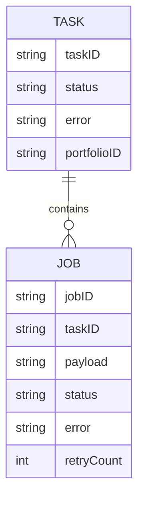

# Entity Relational Schema

```mermaid
erDiagram
    TASK ||--o{ JOB : contains
    TASK {
        string taskID
        string status
        string error
        string portfolioID
    }
    JOB {
        string jobID
        string taskID
        string payload
        string status
        string error
        int retryCount
    }
```

**Notes**
- `retryCount` increments for transient/system retry attempts.
- Task aggregates derive overall status from its Jobs.
