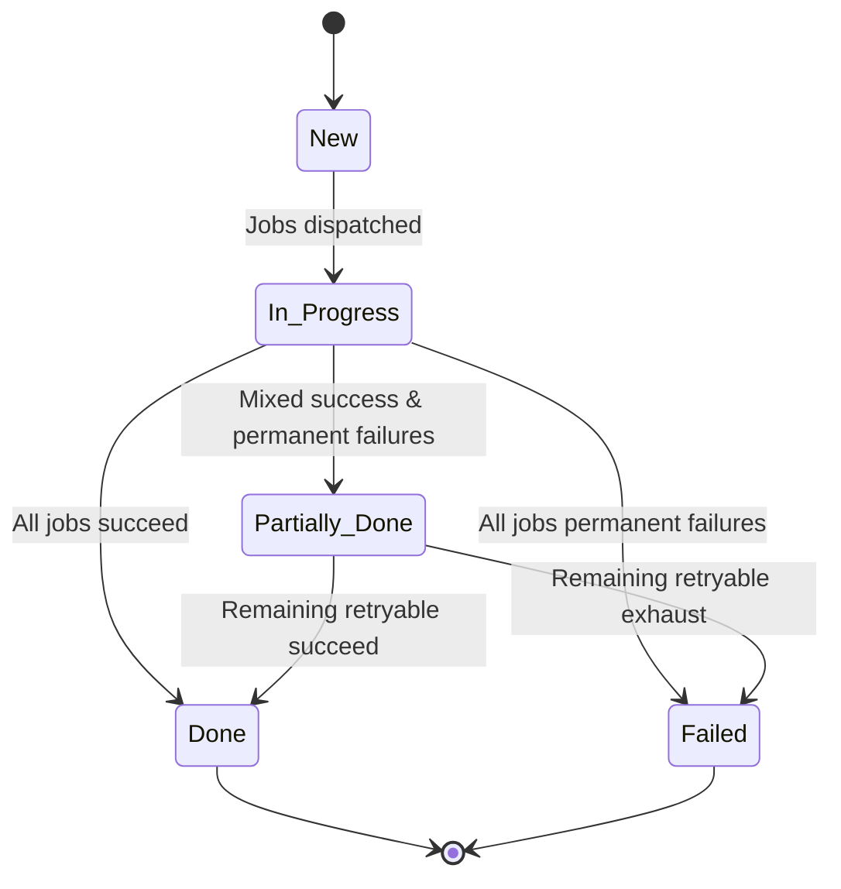
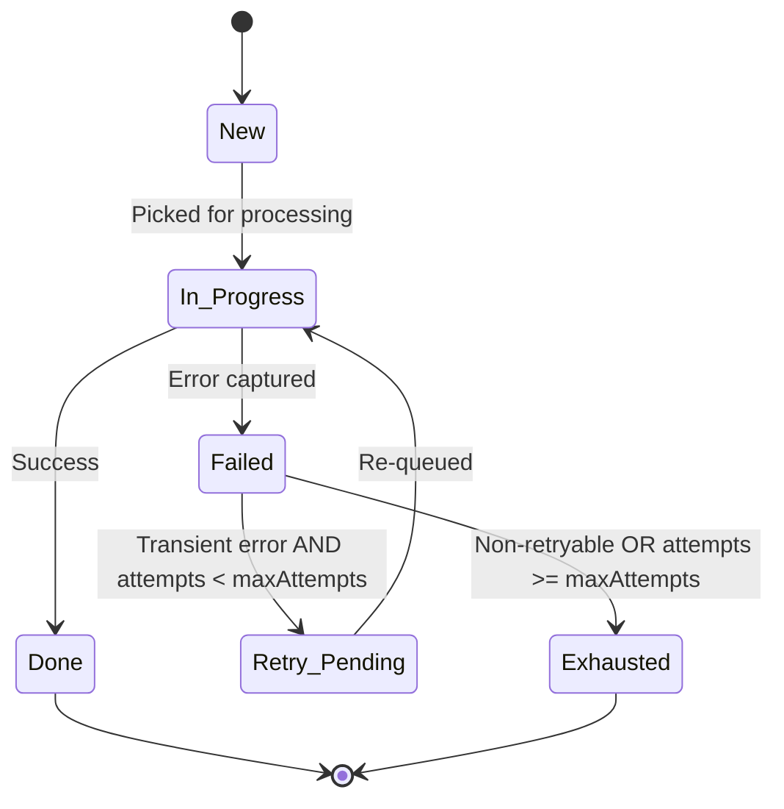

# State Machine Diagrams

## Task State Machine

## Job State Machine

**Notes**
- `Retry_Pending` enables controlled reprocessing.
- `Exhausted` differentiates permanent vs transient failures for aggregation logic.
