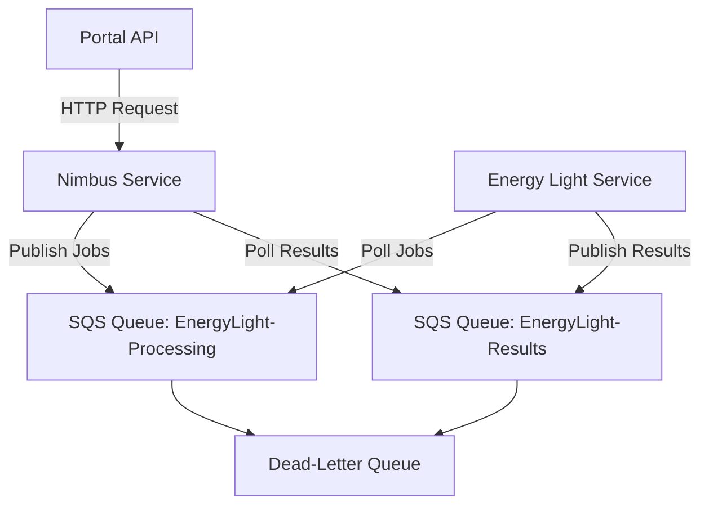

# System Design Overview

```mermaid
flowchart TD
    PortalAPI[Portal API]
    Nimbus[Nimbus Service]
    SQS_Out["SQS Queue: EnergyLight-Processing"]
    SQS_In["SQS Queue: EnergyLight-Results"]
    EnergyLight[Energy Light Service]
    DLQ[Dead-Letter Queue]

    PortalAPI-->|HTTP Request|Nimbus
    Nimbus-->|Publish Jobs|SQS_Out
    EnergyLight-->|Poll Jobs|SQS_Out
    EnergyLight-->|Publish Results|SQS_In
    Nimbus-->|Poll Results|SQS_In
    SQS_Out --> DLQ
    SQS_In --> DLQ
```

**Description**
- DLQ present for both queues to isolate poison messages.
- Separation of processing and results queues enhances resilience.
