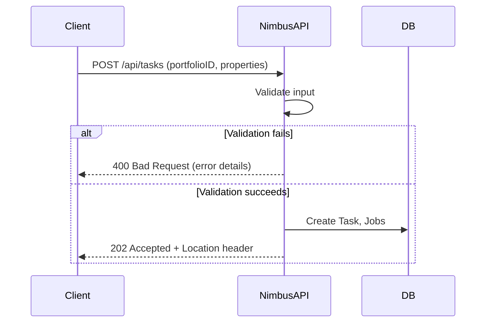

# New Task Workflow

```mermaid
sequenceDiagram
    participant Client
    participant NimbusAPI
    participant DB

    Client->>NimbusAPI: POST /api/tasks (portfolioID, properties)
    NimbusAPI->>NimbusAPI: Validate input
    alt Validation fails
        NimbusAPI-->>Client: 400 Bad Request (error details)
    else Validation succeeds
        NimbusAPI->>DB: Create Task, Jobs
        NimbusAPI-->>Client: 202 Accepted + Location header
    end
```

**Description**
- Synchronous validation prevents unnecessary async load.
- The 202 response contains `Location` for polling task status.
