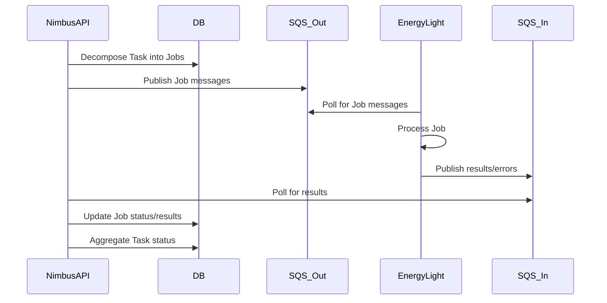

# Task Processing Workflow

**Description**
- Outbound queue decouples ingestion from processing latency.
- Results queue enables durable asynchronous completion reporting.
- Idempotency required in downstream calculations.
