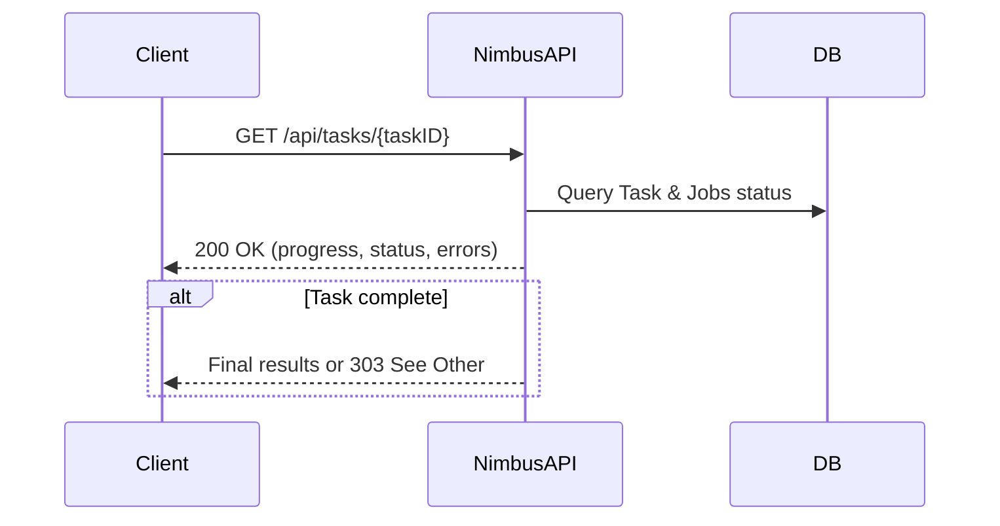

# Task Retrieval Workflow

```mermaid
sequenceDiagram
    participant Client
    participant NimbusAPI
    participant DB

    Client->>NimbusAPI: GET /api/tasks/{taskID}
    NimbusAPI->>DB: Query Task & Jobs status
    NimbusAPI-->>Client: 200 OK (progress, status, errors)
    alt Task complete
        NimbusAPI-->>Client: Final results or 303 See Other
    end
```

**Description**
- Poll-based approach avoids long-lived HTTP connections.
- Optional redirect can point to a permanent results resource.
